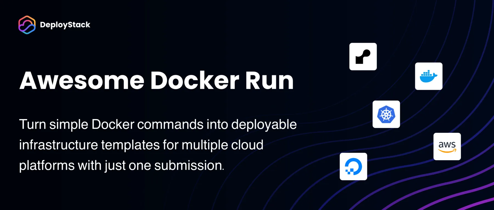

  

A curated collection of Docker run commands that can be easily deployed via [DeployStack](https://deploystack.io).

## Table of contents

<!-- TOC_START -->
- [What is this?](#what-is-this)
- [How it works](#how-it-works)
- [How to contribute](#how-to-contribute)
- [Community](#community)
- [Applications](#applications)
  - [AI](#ai)
  - [Analytics](#analytics)
  - [Audio](#audio)
  - [Automation](#automation)
  - [Bookmark](#bookmark)
  - [CMS](#cms)
  - [Database](#database)
  - [eBook](#ebook)
  - [File Sharing](#file-sharing)
  - [Finance](#finance)
  - [Monitoring](#monitoring)
  - [Notifications](#notifications)
  - [RSS](#rss)
  - [Security](#security)
  - [YouTube](#youtube)
- [License](#license)
<!-- TOC_END -->

## What is this?

awesome-docker-run is a community-driven repository of Docker run commands for various applications. Each command is automatically integrated with DeployStack, enabling one-click deployment to multiple cloud platforms.

## How it works

1. Browse the applications in this repository
2. Find an application you want to deploy
3. Click on the DeployStack button to deploy it instantly
4. Or use the Docker run command directly on your own system

## How to contribute

We welcome contributions! To add your Docker run command:

1. Fork this repository
2. Create a new directory under `commands/` with your application name
3. Add a `docker-run.md` file with your Docker run command
4. Submit a pull request

See [CONTRIBUTING.md](CONTRIBUTING.md) for detailed instructions.

## Community

- Join our [Discord community](https://discord.gg/42Ce3S7b3b)
- Follow us on [Twitter / X](https://x.com/DeployStack)
- Check out [DeployStack](https://deploystack.io) for more deployment tools

## Applications

<!-- APPLICATIONS_START -->

### AI

- [chat2api](commands/chat2api/) - A service that can convert ChatGPT on the web to OpenAI API format.
- [gateway](commands/aI-gateway/) - A blazing fast AI Gateway with integrated guardrails. Route to 200+ LLMs, 50+ AI Guardrails with 1 fast & friendly API.
- [kimi-free-api](commands/kimi-free-api/) - 🚀 KIMI AI 长文本大模型逆向API【特长：长文本解读整理】，支持高速流式输出、智能体对话、联网搜索、探索版、K1思考模型、长文档解读、图像解析、多轮对话，零配置部署，多路token支持，自动清理会话痕迹，仅供测试，如需商用请前往官方开放平台。
- [NextChat](commands/NextChat/) - ✨ Light and Fast AI Assistant. Support: Web | iOS | MacOS | Android |  Linux | Windows

### Analytics

- [EDA](commands/EDA/) - Enterprise Data Analytics by Jortilles ( EDA )
- [liwan](commands/liwan/) - liwan - Lightweight Analytics

### Audio

- [matchering](commands/matchering/) - 🎚️ Open Source Audio Matching and Mastering

### Automation

- [n8n](commands/n8n/) - Fair-code workflow automation platform with native AI capabilities. Combine visual building with custom code, self-host or cloud, 400+ integrations.

### Bookmark

- [neonlink](commands/neonlink/) - Simple self-hosted bookmark service.

### CMS

- [Ghost](commands/ghost/) - Independent technology for modern publishing, memberships, subscriptions and newsletters.

### Database

- [chartdb](commands/chartdb/) - Database diagrams editor that allows you to visualize and design your DB with a single query.
- [meilisearch](commands/meilisearch/) - A lightning-fast search engine API bringing AI-powered hybrid search to your sites and applications.
- [qdrant](commands/qdrant/) - Qdrant - High-performance, massive-scale Vector Database and Vector Search Engine for the next generation of AI. Also available in the cloud https://cloud.qdrant.io/
- [surrealdb](commands/surrealdb/) - A scalable, distributed, collaborative, document-graph database, for the realtime web

### eBook

- [BookBounty](commands/BookBounty/) - Retrieve missing Readarr books from Library Genesis.
- [mylar3](commands/mylar3/) - The python3 version of the automated Comic Book downloader (cbr/cbz) for use with various download clients.

### File Sharing

- [Erugo](commands/Erugo/) - A powerful, self-hosted file-sharing platform built with PHP and Laravel with a Vue.js frontend. It offers secure, customizable file-transfer capabilities through an elegant user interface, giving you complete control over your data while providing a seamless experience for both senders and recipients.

### Finance

- [actual](commands/actualbudget/) - A local-first personal finance app

### Monitoring

- [changedetection.io](commands/changedetection/) - The best and simplest free open source web page change detection, website watcher,  restock monitor and notification service. Restock Monitor, change detection. Designed for simplicity - Simply monitor which websites had a text change for free. Free Open source web page change detection, Website defacement monitoring, Price change notification
- [uptime-kuma](commands/uptime-kuma/) - A fancy self-hosted monitoring tool

### Notifications

- [ntfy](commands/ntfy/) - Send push notifications to your phone or desktop using PUT/POST

### RSS

- [wewe-rss](commands/wewe-rss/) - 🤗更优雅的微信公众号订阅方式，支持私有化部署、微信公众号RSS生成（基于微信读书）

### Security

- [PasswordPusher](commands/password-pusher/) - 🔐   Securely share sensitive information with automatic expiration & deletion after a set number of views or duration.  Track who, what and when with full audit logs.

### YouTube

- [metube](commands/metube/) - Self-hosted YouTube downloader (web UI for youtube-dl / yt-dlp)
- [youtube-dl-server](commands/youtube-dl-server/) - Web / REST interface for downloading youtube videos onto a server.
- [yt-dlp-web-ui](commands/yt-dlp-web-ui/) - A terrible web ui and RPC server for yt-dlp. Designed to be self-hosted.

<!-- APPLICATIONS_END -->

## License

This repository is licensed under the MIT License - see the [LICENSE](LICENSE) file for details.
